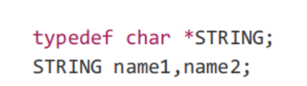
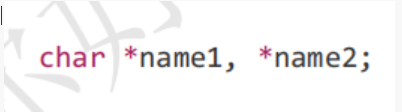
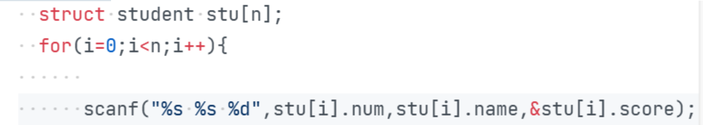

# C语言语法知识

## c常识

### 函数

1. main 一个程序中只有一个

2. ```c
	#include <stdio.h>  //include引入库中的函数（有声明，没有定义）
	/*int main() {}     // 类型 名称 （参数） {功能};一个c程序有且只有一个main函数*/
	int main() {
		printf("%d", 2);//%d-整占位符，printf是库中的函数。$printf代码
		return 1;       //返回一个值。 ？不同返回值会带来不同影响
	}
	```

	***（1）printf代码的格式***

	***（2）不同返回值带来的影响***

3. 类型 名称(参数) {功能}

	int add（int a,int b）{

	return a+b;

	}

### 数据类型

**整**

| 类别   | expression   | vs2019大小(byte) |             十进制范围              |
| ------ | ------------ | ---------------- | :---------------------------------: |
| 较小整 | char         | 1                |                                     |
| 较小整 | short        | 2                |                                     |
| 一般整 | int          | ==4==            |        -2^3^-0     0-2^3^-1         |
| 长整   | long         | ==4==            |                                     |
| 超长整 | long long    | 8                |                                     |
| 无符号 | unsigned int | 4                | 0~2^4^-1(0-255)*256个点，255个区间* |

***1.?硬件存储，晶体管***

2.1字节=8byte

3.sizeof(int)=4  byte

4.==0==000 0001 = ==+==1

   ==1==000 0000 = ==-==128 *原码 反码 补码*

5.unsigned

**浮点数**

***？用二进制表示小数***

| 类别 | expression         | 大小     |
| ---- | ------------------ | -------- |
| 小   | float(占位符%f)    | 4，有效6 |
| 大   | double（占位符%f） | 8        |

### 数据使用

变量>常量

##### 变量

1. 声明变量： *类型 > 标识符;*

> 标识符
>
> > 英文，数字，下划线
> >
> > > 数字不能开头
> > >
> > > >不能使用关键词

2. 变量初始化  int a = 100;
3. 变量赋值      a = 100;

##### 常量

1.#define Price 3 ~~;~~

2.自动读取

##### 字符型

```c
"hello" 'h'
printf("字符串"); or printf("%c%c",'h','e');

sizeof('a') = 4/1;//4在.c 1在.cpp

char c = 'A';
sizeof(char);
sizeof(c);

```

A==SCII==

| DEC  | OCT  |      | CHAR |
| ---- | ---- | ---- | ---- |
| 65   |      |      | A    |
| 97   |      |      | a    |
| 48   |      |      | 0    |
| 0    |      |      | NUL  |

转义字符

\OCT>>>char

| \OCT | \C   |         |
| ---- | ---- | ------- |
| \7   | \a   | 报警    |
| \10  | \b   | 退格    |
| \14  | \f   | 换页    |
| \12  | \n   | 换行    |
| \15  | \r   | 回车    |
| \11  | \t   | 水平tab |
| \13  | \v   | 垂直tab |

## printf函数

### printf 二进制数据 转换规范 字符

1.占位符printf("%d %ld %lld",int以下,long,long long);

无符号：%u %lu %llu

2.转换规范中的转换操作

| %d   | char/short/int              |
| ---- | --------------------------- |
| %c   | printf("%c%c",'g','d','x'); |
| %s   | printf("%s","gdx");         |
| %u   | unsigned char/short/int     |
| %f   |                             |
| %e   | exponent-指数               |
| %E   |                             |
| %x   | 十六进制                    |
| %X   |                             |
| %o   | 八进制                      |

3.转换规范中的长度指示符

```c
printf("%d",4);
printf("%ld",8);
printf("%hd",2);
printf("%hhd",1);
```

4.转换规范中的==精度==

```c
printf("%.6d",123);//000123
printf("%.4f",123.456789);//123.4567
printf("%.6f",123.456789);//123.456789
printf("%f",123.456789);//123.456789
```

5.转换规范中的最小字段==宽度==

```c
printf("%2d",1234);//1234
printf("%6d",1234);//  1234
printf("%12f",123.456789);//  123.456789
```

6.转换规则中的标志

| %0   | 用0补齐            |
| ---- | ------------------ |
| %-   | 左对齐             |
| %+   | 显示符号           |
| %#   | 八进制0 十六进制0X |

7.常用

```c
printf("%.2x")//两位十六进制数 >%02x
printf("%0.1d")//需要则用0补充，保留一位小数
```


## scanf函数

*vs __CRE_SECURE_NO_WARNINGS*

*scanf_s(" ");*

### scanf 输入字符 转换规范 二进制

1.输入字符

分割号对应

2.存储

&基本变量 /字符数组

```c
char str[10];
scanf("%s",str);
printf("%s",str);
```

3.字符串对应大小

%hhd %hd %d %ld %f %lf


4.输入字符串

```c
char c;
scanf("%c",&c);
printf("%d %c",c,c);
```

==?scanf输入二进制八进制十六进制== %x %o 

## 运算

### 1.乘除

整形/整形会被截断

double/double=double

int/int=int

### 2.求余数

奇偶算法：%2

### 3.自增自减

1. 简单的表达式 中x++和++x表示着相同的意思，比如常用于for循环语句中；
2. 当 递增 或者 递减 的运算结果被直接用在其他表达式中，x++与++x就代表着 **不同** 的意思了
	++x：变量 x的值==先增加== ，再 计算整个表达式的值 ；
	x++：变量x的值在 ==表达式计算后== 再增加；

| 运算 | i    | 表达式 |
| ---- | ---- | ------ |
| i++  | i+1  | i      |
| ++i  | i+1  | i+1    |

==*放在前面全加*==

```c
int a=1;
b=a++ + a++ + a++;
vs:b=1+1+1;
gcc:b=1+2+3;
```

### 4.运算中类型变化

1.级别

> double
>
> > float
> >
> > > u long
> > >
> > > long
> > >
> > > > u int
> > > >
> > > > int
> > > >
> > > > > u short
> > > > >
> > > > > short
> > > > >
> > > > > > u char
> > > > > >
> > > > > > char

2.转换

（dounle）n

（int）d

### 5.运算符

| 运算符       | 级别          | 作用 |
| ------------ | ------------- | ---- |
| > <          | 关系          |      |
| >= =<        |               |      |
| == !=        |               |      |
| \|\|（0，0） | 逻辑          | 或   |
| &&（1，1）   |               | 与   |
| ！           |               | 非   |
| ++ --        | 自增（后>前） |      |
| + -          | 运算          |      |
| + -          | 符号          |      |
| * / %        |               |      |

自增>！>算术>关系>&&>||

## 分支

1.单链

```c
if
else if
else if
```

AB多链

```c
if()
if()    
```

ABC多门

```c
switch()
    case: ;break;
```

2.条件表达式   *唯一的三元运算符*

```c
c= x>0? a:b;
```

## 循环

==*感想*==

写for时：

for（1，2，3）

4

顺序应该是：1->4->3->

### 0.次数

```c
for(i=1；i<=10;i+4)//（终点-起点）/步长+1
```


### 1.求和

while

```c
int sum,i;
sum=0;i=1;
while(i<=100){
    sum=sum+i;
    i++;
}
printf("%d",sum);

```

==非0为真==

while**用法**：

| i=1  | ...  | i<=100 | i++  | i=100+1 |
| ---- | ---- | ------ | ---- | ------- |
| 1    |      | 100    |      | 101     |

for

```c
//for(计数器初始值;循环条件;计数器更新)
int i,sum=0;
for(i=1;i<=100;i++)
    sum=sum+i;
printf("%d %d",sum,i);//5050 101
```

for**写法**：

1.int i=1; for(;i<=100;i++)

2.for(int i=1;i<=1;i++)

2.for(i=1;i<=100;) i++;

3.for(i=1;;i++)

### 2.循环嵌套

```c
for(cahr c='A';c<='E';c++){
for(int i=0;i<=9;i++)
    printf("%c%d",c,i);
}
```

### 3.循环辅助

break：跳出循环

continue：回到循环

## 数组

### 1.一维数组

##### 1.定义数组

```c
int arr[10];
```

##### 2.初始化数组

```c
int arr[10]={1,2,3,...,10};
int arr[]  ={1,2,3};
int arr[10]={};
int arr[]  ={1,2,...,11};
```

##### 3.数组赋值

==**初始化和赋值不同**==

（1）整个数组

```c
int arr[10];
arr[10]=?;
for(int i=0;i<10;i++){
    scanf("%d",&a);
    arr[i]=a;
}
```

（2）单个元素

```c
arr[5]=6;
```

##### 4.使用数组

**遍历数组**

```c
for(int i=0;i<10;i++){
    printf("%d",arr[i]);
}
```

##### 5.数组覆盖

（1）for

```c
for(int i=0;i<10;i++)
    a1[i]=a2[i];
```

（2）#include <memory.h>

memcpy(a1,a2,sizeof(a1));

### 2.多维数组

> 多维数组的本质：不变的存储格子，相当于每一位有不同进制的索引

##### 1.定义数组

```c
//原始定义
int[3] a[2];
//改变形式
int a[2][3];
```

##### 2.初始化

```c
int a [2][2][2]={
    {{1,2},{1,2}},{{1,2},{1,2}}
};

```

##### 3.数组赋值

**嵌套遍历**

```c
for(int i=0;i<2;i++)
    for(int j=0;j<2;j++)
        for(int k=0;k<2;k++){
            scanf("%d",)
            a[i][j][k]=a;
        }
```

### 3.字符数组

##### 1.字符数组本身

1.形式:

```c
str[2]={'1','\0'};
str[2]="1";
str[]="fhjkahfhdoihodw...";
```

2.大小：

sizeof( str[6] )=6;

sizeof("hello")=6;

##### 2.字符数组与字符串

1.字符串本身是数组

2.数组可以用来表示字符串

> （1）初始化 
>
> ```c
> char str[]={0};
> char str[2]={'1','\0'};
> char str[2]={'1'};//没有0结尾
> char str[2]="1";//有0结尾
> ```
>
> （2）输入   
>
> ```c
> scanf("%s",str);//("%7s",str)
> 
> gets(数组名);//gets_s
> 
> while((str=getchar())!='\n')
>     
> while(1)
>     getch();
>     if()
>         break;
> ```
>
> （3）输出  
>
> ```c
> printf("%s",str);
> puts(str);
> while(str[i]!='\0')
>  putchar(str[i]);
> ```

##### 3.字符大小

1.空间大小：sizeof

2.字符长度：（1）while计数

​                      （2）#include <string.h>

​                               strlen(str)

##### 4.==字符串输入实例==

####### 已知字符数目进行字符分类统计

```c
#include<stdio.h>
int main(){
    int l,b,d,o,i;
    char ch;
    l=b=d=o=0;
    for(i=1;i<=10;i++){
        ch=getchar( );
        if((ch>='a')&&(ch<='z'))
        l++;
        else if((ch>='A')&&(ch<='Z'))
        l++;
        else if((ch=='\n')||(ch== ' '))
        b++;
        else if((ch>='0')&&(ch<='9'))
        d++;
        else
        o++;
    }
    printf("letter = %d, blank = %d, digit = %d, other = %d",l,b,d,o);
}
```


####### gets

```c
gets(数组名)
```

####### while

```c
int i=0;
char str[];
while(1){
    str[i++]=getchar();
    if(str[i]=='\n')//结束标志
        break;
}
str[i]='\0';
```

```c
while((str[i]=getchar()!='\n')//结束标志
      i++;
str[i]='\0';
```

####### scanf

```c
//预处理_CRE_SECUR_NO_WARNINGS
scanf("%s",str)
```


## 缓存

**缓存：完成前的准备状态**

### 1.缓存输出

windows

```c
#include <stdio.h>
#include <windows>h>
int main(){
    int i=0;
    while(i++<10)
    printf("hello %d",i);//立即刷新缓存
    Sleep(500);//500毫秒=0.5秒（1000）
}
}
```

Linux

```c
#include<stdio.h>
#include<unistd.h>
int main(){
    int i=0;
    while(i++<10){
        printf("hello %d",i);//累计刷新缓存>完全缓存
                             //          >行缓存："hello %d\n"
        usleep(1000*500);//1000*500微秒
    }
}
```

### 2.缓存输入

scanf

```c
scanf("%s",s);//ABCD \n >缓存区
```

getchar

```c
c1=getchar();//输入 A \n
c2=getchar();
//c1=A c2=\n
```

```c
c1=getchar();
getcahr();//把多余的\n消除
c2=getchar();
```

### 3.无缓存输入

getch & getche

```c
#include<stdio.h>
#include<conio.h>
int main(){
    c=getch();//直接读取  
              //       >==getche();
    putchar(c);
}
```

### 4.复合

```c
//输入123\n
c1=getchar();//1,缓存区中有23\n
putchar(c1);//1
c2=getch();//无输入，需要重新输入
putchar(c2);
c3=getchar();//延用缓存区23\n
putchar(c3);//2
```

## 函数

### 1.定义/写法/调用

输入>内部处理>返回结果

```c
int add(int a,int b){//函数头
    return a+b;//函数体
}
```

```c
double square(double a,double b,double c){
    if(a+b>c&&a+c>b&&c+b>a){
        p=(a+b+c)/2.0;
        return sqrt(p*(p-a)*(p-b)*(p-c));
    }
    else
        pritntf("Not a tringle\n");
    
}
```

```c
//函数在前
定义
调用
//函数在后
double square(double a,double b,double c);//名字可省略
int main(){}
double square(){
    
}
```

### 2.形式参数和实际参数

```c
#include<stdio.h>
void swap(int a, int b) {
	int temp;
	temp = a;
	a = b;
	b = temp;
	printf("%d%d\n", a, b);
}
int main() {
	int c, d;
	c = 1, d = 2;
	swap(c, d);
	printf("%d%d\n", c, d);
}
```

### 3.变量

函数变量是局部变量

### 4.函数递归

函数自己调用自己

ctrl+c结束无限循环

递推回归

```c
void fun(int n){
    printf("递推%d\n",n);
    fun(n+1);
    if(n==3)
        return;
    printf("回归%d\n",n)；
}
fun(0);
/#include <stdio.h>
void fun(int n) {
    if (n == 3)
        return;
    printf("递推%d\n", n);
    fun(n + 1);
    printf("回归%d\n", n);
}
int main() {
    fun(0);

}
```

##### ==**函数递归实例**==

####### 1.阶乘

```c
//n!=n*(n-1)!&&0!=1!=1
int f(int n){
    if(n==0||n==1)
        return 1;
   return n*f(n-1);
}
int f(int n){
    return n==0||n==1?1:n*f(n-1);
}
```

####### 2.斐波那契数列

```c
//n>=3
int a(n){
	if(n==1||n==2)
        return 1;
    return a(n-1)+a(n-2);//n==3
}
int a(n){
    return n==1||n==2?1:a(n-1)+a(n-2);
}
```


### 5.指针函数

```c
int* func(){
    static int n=100;//static静止
    return &n;
}
int main(){
    int* p=func();
    printf("%d",*p);
}
```


## 指针

### 1.概念

```c
   int* pn=&n;
   char* pn=&n;
//空间大小    首地址
```

&：首地址+空间大小

==任何类型对象==：1.内存 2.数据

```c
*:根据地址与大小取到数据
```


### 2.运算

##### 1.赋地址

```c
int* p;
p=100;//int*与int无法直接转化
p=(int*)100;//强制转化 (大小)地址
```

##### 2.自加减

```c
int* p;
p+1;//向后加了一个sizeof(int)
```

##### 3.互减

```c
int* p1,p2;
p1-p2=1;
int* arr[6];
arr[5]-arr[0]=5;//偏移了五个单位，地址差20，第一元素与第六元素
```

*注：互加、互乘、乘除无意义*

### 3.指针参数

1.普通函数和主函数是调用关系

```c
void swap(int x,int y);
int main(){
    int a,b;
    swap(a,b);
    printf("%d %d",a,b);//主函数中变量内存上的值没变；改变的是swap函数中定义的形参
}
```

2.指针参数函数是展开关系

```c
void swap(int* x,int*y){
    temp=*x;
    *x=*y;
    *y=temp;
}
int main(){
    int a.b;
    swap(&a,&b);
    printf("%d %d",a,b);//在内存上进行了修改
}
```

==??3.void指针==

```c
int* p;//首地址 + sizeof（int）
void* p;//首地址  无大小
```


```c
void sawp(void* x,void* y,int size){
    char* px,py;
    px = (char*)x;
    py = (char*)y;
    char temp[128];
    
    for(int i=0;i<size;i++)
        temp[i] = px[i];//?指针变数组?
    ...
}
```

4.多级指针参数

goal：函数返回指针变量

类比：函数返回

```c
#define NULL 0
void func(int** a,int** b){
    static int x=100;
    static int y=200;
    *a=&x;
    *b=&y;
}
int main(){
    int* a=NULL;
    int* b=NULL;
    func(&a,&b);
    if(a!=NULL &&b!= NULL)
        printf("%d%d",*a,*b);
}
```


### 4.指向数组的指针

*前提：数组是从首地址开始的同一组数*

##### 1.数组地址

```c
数组地址，指针
int* p;int arr[3];
p = &arr[0];// p=&arr[1];p=&arr[2];
p = arr;
//那么
*p = *&arr[0]=arr[0];
*p = *arr    =arr[0];
*(p+1)=*(arr+1)=arr[0]=*(&arr[0]+1);
```

##### 2.数组名

```c
//数组名是指针，指针的值是首地址
int* p = arr;
//数组指针arr的大小
sizeof(arr)=类型内存*个数;
sizeof(arr+1)=类型内存
```

1、单独使用数组指针代替一整个数组

2、在表达式中代表首个元素地址

##### 3.数组的实质是指针

```c
arr[k]=*(arr+k);//e.g arr[0]=*(arr+0);
k[arr]=*(k+arr);//用偏移，遍历停止的思想
```

##### 4.总结

1.数组本身就是指针，而指针的值是地址，arr是数组名，也是数组指针（指向arr[0]）

2.处理数据串联考虑，先内存，后数据

3.以0开头计数的好处方便计算

##### 5.指向多维数组的指针


####### a.二维

1.首地址不变

2.指针步长改变

| 数组         | 首地址   | 步长           | 指针定义                                      |
| ------------ | -------- | -------------- | --------------------------------------------- |
| int a[X]     | &a[0] ,a | sizeof(int)    | int *p=a;                                     |
| int b[X] [Y] | &b[0],b  | sizeof(int[Y]) | int (*pint)[10]=b; *区别*：*int* **pint[10];* |

### 5.元素为指针的数组

##### 1.定义

int* pa[3];

##### 2.使用

/*指针数组的使用*/

##### 3.多级指针

==内存：地址和大小==


多级指针：指向指针的指针变量

```c
以二级指针为例
int n=1;
int* p1;
int** p2;
p1=&n;/ *p1=1;
p2=&p1;/ **p2=1;
```

##### 4.多级指针和指针数组

```c
目的：遍历多个数组
int a1[5],a2[5],a3[5];
int* pa1[3];
int** pa2;
pa1[0]=a1;pa1[1]=a2;pa1[2]=a3;
for(int i=0;i<3;i++){
    pa2=pa1+i;
    for(int j=0;j<5;j++)
        printf("%d",*(*pa2+j));
}
```


## 结构体（类）

### 1.定义结构体


==与类的区别就是定义完之后也要一直加struct==


*补充typedef*

| typedef                                            | define                                             |
| -------------------------------------------------- | -------------------------------------------------- |
|                        |  |
|  |  |

==*结构体三种定义的区别*==

| struct 结构体名{ }；struct 结构体名 实例1；                  | struct 结构体名{  }实例1，实例2；    | struct {  }实例1，实例2；       |
| ------------------------------------------------------------ | ------------------------------------ | ------------------------------- |
| 结构体定义和实例分离          结构清晰                最常用 | 结构体和实例结合      适用于少量数据 | 结构体定义完无法复用     最少用 |

### 2.初始化

##### 1.固定初始化

`struct person Tom ={"name",age,sex};`

##### 2.输入初始化



### 3.使用结构体

##### 1.结构数组


##### 2.类指针

`struct person *ptTom;`

访问：

箭头：`ptTom->age`

寻址：(*ptTom).age

### 4.联合和枚举

##### 联合

```c
union{
    char x;
    short y;
    int z;
};
```

##### 枚举

```c
enum {
    first=1,
    two,
    three,
}；
```

## 多文件编程

### 1.作用

在大型工程中，可以化简函数，进行分工。大事化小

方法：

将原来的一整块代码分成三个部分：函数声明部分，函数实现部分，函数使用部分（main）

1.头文件——函数声明

2.fun.c——函数实现部分

3.main.c——函数使用部分

### 2.头文件

作用：声明函数的文件，避免include重名，连接错误


### 2.代码模块化

main.c：

```c
#include "print.h"
int main
```

print.c:

```c
#include "print.h"
void print(){
    
}
```

print.h

```c
void print();
```

程序运行过程：

编写源代码，编译，链接

编译时，编译器需要提前知道这个东西是什么，即使是一个空函数，也要写在最前面

例如：gcc main.c print.c -o p

如果没有声明，编译错误

如果提前声明，那么编译器会将之后的print.c文件重定位


## 变量类别

抓住两个关键：时间，空间

术语是：生命周期，作用域

```c
auto int n; //自动变量 函数内 函数结束销毁
static int n; //静态变量 函数内 程序结束销毁
int n; //全局变量 全局 程序结束销毁
```


## 文件

### 1.相关操作

```c
/*文件指针*/
FILE *f；

/*打开文件并使用*/
f=fopen(const char* filename,const char* mode);//文件地址，读或写：w，r，a,w+,r+
f=fopen("data.txt","wb");

/*向打开的文件中打印数据*/
int fprintf(FILE* stream,const char* format,...);
	fprintf(f,"%d",n);
int fputc(int character,FILE* stream);
int fputs(const char* str,FILE* stream);

/*关闭文件资源*/
int fclose(FILE* stream);

/*从打开的文件读入数据*/
int fscanf(FILE* strea,const char* format,...);
	fscanf(f,"%d",&n);
int fgetc(FILE* stream);//失败返回EOF：end of file :#define EOF -1
char* fgets (char* str,int num,FILE* stream);//成功返回str 失败返回NULL

/*测试文件状态*/
int feof(FILE* stream);//结尾回非0
int ferror(FILE* stream);//文件出错非0

/*移动文件指针*/
int fseek(FILE* f,int offset,int origin);//成功返回0
origin:SEEK_SET/CUR/END;
int rewind(FILE* f);//fseek(f,0,SEEK_SET);

/*当前文件指针对起始位置的偏移量*/
long ftell(FILE* f);//成功返回文件指针位置
```

### 2.常用组合

##### 1.向文件中打印字符串

```c
/*打开*/
FILE* f=fopen("data","w");
if(f==NULL)
    return -1;
char str[]="abc\n";
char* p=str;
/*打印*/
while(*p!='\0'){
    fputc(*p,f);
    p++;
}
/*
fputs(str,f);
*/
fclose(f);
```

##### 2.检测文件空或出错

```c
void fileEOForERROR(FILE* f){
    if(feof(f))
        printf("end of file\n");
    else if(ferror(f))
        printf("file access error\n")
}
```

##### 3.获取文件字节个数

```c
/*指针偏移到末尾后获取指针位置*/
fseek(f,0,SEEK_END);
long length;
length=ftell(f);
```

##### 4.修改文件内容

==注意：写转读，读转写时应该使用fseek函数==

```c
/*用r+模式，先读，后写*/
f=fopen("data.txt","r+");
while(1){
    ch=fgetc(f);//读入后即后移
    fseek(f,-1,SEEK_CUR);
    if(ch=='h')
        fputc('h',f);
}
```


### 3.向文件中打印数据的缓存机制

```c
#include<stdlib>
FILE* f=fopen("data.txt","w");
char str[]="abc";
fputs(str,f);
system("pause");/*在程序运行过程中，在此停止，打开文件发现并没有数据写入*/
fclose(f);
```

fputs -> 缓冲区 -> 文件关闭/程序结束 -> 缓冲区刷新+将数据写入文件（可以主动调用fflush）

`int fflush(FILE* stream);//成功返回0，失败返回EOF`

## 动态内存管理

```c
type* p;
p=(type)malloc(sizeof);
free(malloc);
```

存在的问题:

1.越界访问动态内存

2.没有释放动态内存

3.内存泄漏：没有相应的指针对应分配的动态内存

## 主函数参数

`int main(int argc,char* argv[]);`  char* argv[]=char** argv

argc：传入参数的个数

argv：传入的参数
