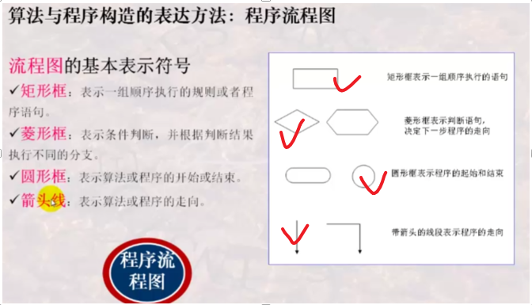

# 7-算法

## 前言

该章节学习的重点放在解决问题的方法——算法上  
  
1.首先从自然/社会问题出发——问题 问题求解  
2.接着需要对问题进行符号化和计算化——数学建模  
3.其次需要设计解决方法——**程序设计**  
程序设计  
{  
数据结构（n）  
控制结构（v）  
} 算法策略；  
4.紧接着要对解决方法进行评价，首先追求{1.能够解决问题；cost(2.追求用更少的时间达到效果；3.追求用最少的空间和资源)}  
## 学习内容  
问题是什么？  
- 戈尼斯堡七桥  
- 梵天塔  
- **TSP(traveling salesman problem)****——旅行商问题——旅行费用最小——最小路径规划问题**  
问题模型  
  
问题实例：  
半导体制造  
物流运输  
问题求解过程  
  

解决问题的方法？  
1.数学建模  
什么是数学建模？  
描述：用数学语言描述现象  
实例：  
戈尼斯堡七桥  
  

程序设计  
2.数据结构设计  
什么是数据结构？  
描述：是 逻辑结构 存储结构 操作集 的总称（看成一个三元组集合） ps:逻辑结构（数模）和存储结构（单元）之间是代码  
  
实例：  
变量{ “房间里存放的是人”，-，“直接访问房间就能找到人” }  
指针{ “房间里存放的是地址”，-, “需要访问房间里的地址到另一个房间找人” }  
树{ “房间里有一个父亲，还拿着两个儿子的房号”，—，“可以找到父亲也可以根据父亲找到孩子孙子” }  

3.控制结构设计  
什么是控制结构？  
描述：顺序结构 分支结构 循环结构 {有界循环（知道结束条件）、条件循环（不知道结束条件）}  
实例：  
流程图  
  
  
  
练习：  
  

利用学习到的方法**解决****TSP****问题**  
使用Dj算法  
  

评价方法的优劣  
1.算法得到结果是正确的吗？  
一个解  
多个解{可行解，最优解}——可行解和最优解的差距有多大？——数学证明，统计分析  
2.一个算法是可行的吗？  
不需要无限的时间——时间复杂度  
可求解问题——时间复杂度O(n多项式函数)  
难解性问题——空间复杂度O(n指数函数/阶乘)  
不需要无限的空间——空间复杂度

## 课程附带的练习题  
## 学习存在的问题  
1.好的数据结构设计的评价标准是什么？

## 进一步学习方向  
如何根据实际问题设计数据结构？  
如何利用已经设计好的数据结构和控制结构？

